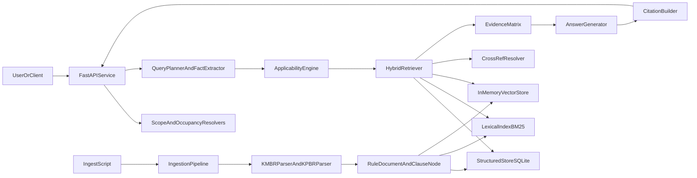
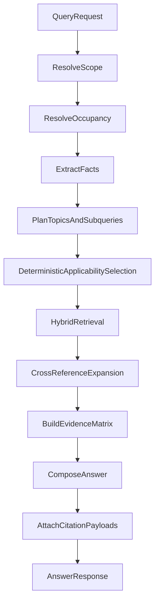
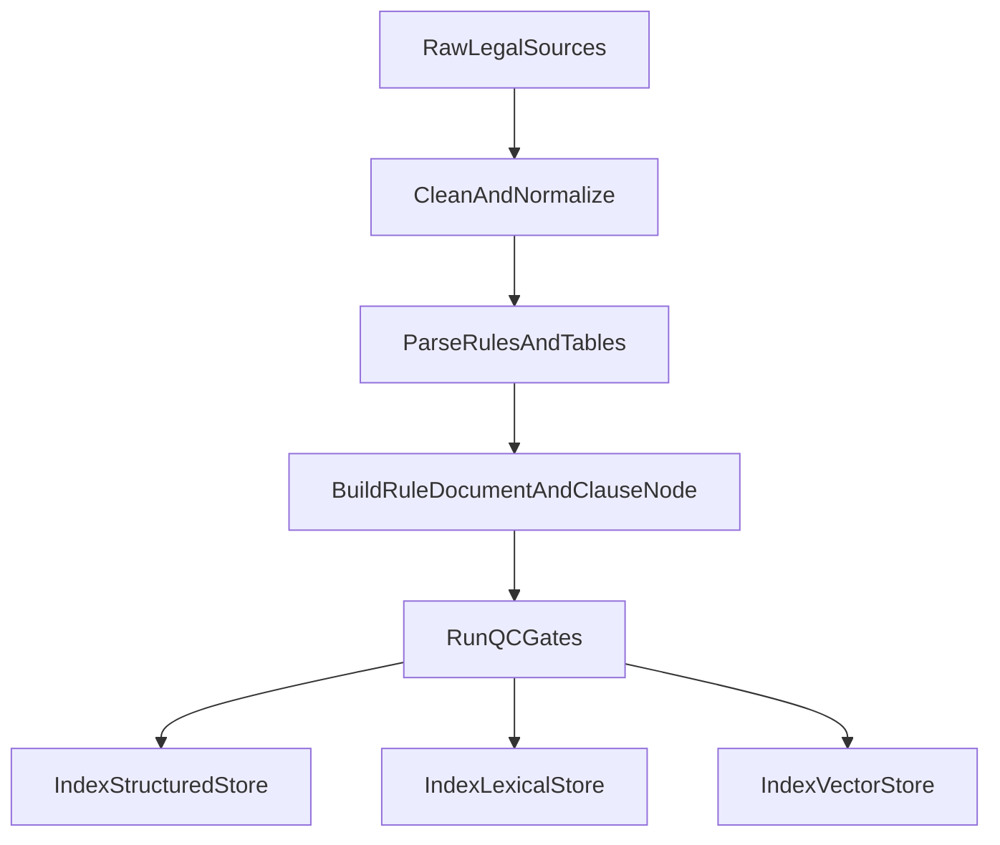
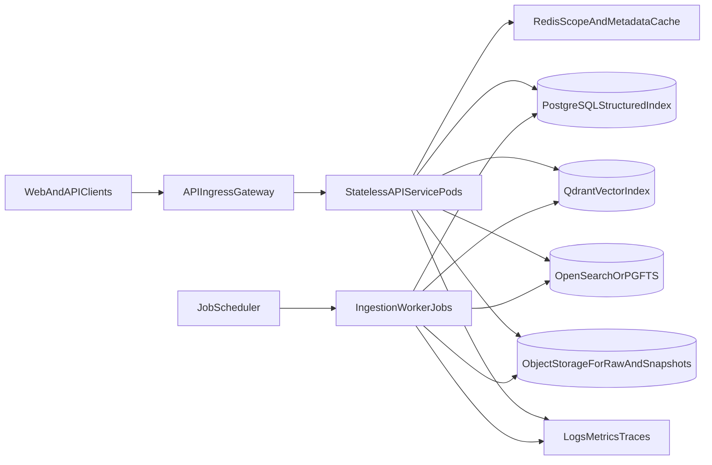

# PlotMagic Tutorial

This tutorial explains:

1. what has been built,
2. how to run and use it,
3. how to extend it safely,
4. what to improve next.

It is written for both experienced engineers and interns joining the project.

---

## 1) What PlotMagic is trying to solve

PlotMagic is a **jurisdiction-aware legal compliance assistant** for Indian building rules.

It is not a generic chatbot. It is designed as:

- a **deterministic rule-selection engine**, plus
- a **RAG-backed legal explanation layer** with citations.

For Kerala specifically, the system must decide whether a query should use:

- `KMBR` (municipality rules), or
- `KPBR` (panchayat rules, with Category-I / Category-II nuances).

Then it must return:

- applicable clauses,
- occupancy-aware + generic rules,
- source-traceable citations to exact rule anchors.

---

## 2) What has already been implemented

### A. Canonical legal data model

Implemented in:

- `src/models/documents.py`
- `src/models/schemas.py`

#### Why these models were chosen

We deliberately split the model layer into two parts:

1. **Domain models (dataclasses)** in `documents.py`  
   Used internally by ingestion, retrieval, and generation.
2. **API schemas (Pydantic models)** in `schemas.py`  
   Used at request/response boundaries for validation and client-safe payloads.

This split prevents API shape decisions from polluting core legal reasoning logic.

#### Design principles behind model choices

- **Determinism first**: routing/filtering decisions must come from explicit fields, not hidden prompt logic.
- **Legal traceability**: every claim must map to source text with anchor metadata.
- **Temporal validity**: amended vs original text must be represented with effective ranges.
- **State agnosticism**: source formats vary, but output contracts should stay stable.
- **Progressive granularity**: support both whole-rule retrieval and clause-level precision.

#### Domain models and how they connect

Core entities:

- `RuleDocument`: the top-level canonical object for each rule.
- `ClauseNode`: child-level legal units (rule/sub-rule/proviso/note/table/etc.).
- `TableData`: structured representation of legal tables.
- `CrossReference`: directed links between clauses/rules/tables/appendices.
- `AmendmentRecord`: normalized amendment metadata and effective ranges.
- `Citation`: final claim-linked reference object for answer generation.
- `QueryFact`: extracted, deterministic facts from user query.

Relationship map (conceptual):

```text
RuleDocument
  |- amendments: [AmendmentRecord]
  |- tables: [TableData]
  |- cross_references: [CrossReference]
  |- clause_nodes: [ClauseNode]
        |- table_data: TableData? (for table clauses)
        |- amendments: [AmendmentRecord]
        |- cross_references: [CrossReference]
```

#### Why both `RuleDocument` and `ClauseNode` are needed

- `RuleDocument` is the best unit for:
  - deterministic candidate selection,
  - rule-number access,
  - broad retrieval.
- `ClauseNode` is the best unit for:
  - precise citations,
  - proviso/exception handling,
  - table-level and sub-rule-level semantic matching.

If we kept only rule-level objects, we would lose legal precision.  
If we kept only tiny clauses, we would lose legal context and increase retrieval noise.

#### Temporal model and amendment handling

`effective_from` and `effective_to` appear in core models so retrieval can do date-aware filtering.

Why this matters:

- legal text changes over time;
- without temporal fields, amended and superseded clauses can be mixed incorrectly.

#### Traceability fields and why they are mandatory

Key fields such as:

- `source_file`
- `anchor_id`
- `display_citation`
- `quote_excerpt`

exist so every answer is auditable.  
This is critical for a compliance assistant where users need to verify exact legal backing.

#### API schemas and boundary contracts

From `schemas.py`:

- `QueryRequest`, `ApplicabilityRequest`, `IngestRequest` validate inbound payloads.
- `AnswerResponse`, `CitationPayload`, `EvidenceItem`, `IngestResult` define outbound contracts.

Why Pydantic here:

- strict validation (`top_k` bounds, required fields),
- predictable API shape for frontend and tests,
- easy serialization for logs and integration workflows.

#### End-to-end object flow (important for interns)

When a query enters the system:

1. API receives `QueryRequest`.
2. Resolver/extractor builds `QueryFact`.
3. Ingested corpus provides `RuleDocument` + `ClauseNode`.
4. Applicability and retrieval operate on these canonical models.
5. Evidence is collected into `EvidenceItem` entries.
6. Generator emits `AnswerResponse` with `CitationPayload`.

So the model chain is:

`QueryRequest -> QueryFact -> RuleDocument/ClauseNode -> EvidenceItem -> AnswerResponse/CitationPayload`

#### Practical guidance for interns

Before changing logic, identify which layer you are touching:

- **Parser bug?** Update how `RuleDocument` and `ClauseNode` are produced.
- **Routing bug?** Update `QueryFact` extraction/resolution logic.
- **Citation bug?** Verify mapping from `EvidenceItem` to `CitationPayload`.
- **API mismatch?** Update Pydantic schemas, not core dataclasses first.

Why this matters:

- keeps architecture clean,
- reduces accidental regressions,
- makes reviews and debugging much easier.

### B. Ingestion and parsing pipeline

Implemented in:

- `src/ingestion/pipeline.py`
- `src/ingestion/cleaners.py`
- `src/ingestion/normalizers.py`
- `src/ingestion/parsers/kmbr_html_parser.py`
- `src/ingestion/parsers/kpbr_markdown_parser.py`

Current behavior:

- parses KMBR chapter HTML files (`chapter*.html`)
- parses KPBR markdown
- extracts rules, provisos, notes, tables, cross-references, occupancy mentions
- captures amendment metadata and effective dates when present
- runs QC checks (duplicate IDs, missing anchors, missing headers, etc.)

### C. Deterministic scope + occupancy resolution

Implemented in:

- `src/retrieval/scope_resolver.py`
- `src/retrieval/occupancy_resolver.py`
- `src/retrieval/fact_extractor.py`
- `config/local_bodies/kerala_local_bodies.yaml`
- `config/states.yaml`

Current behavior:

- resolves location to municipality/panchayat deterministically
- supports panchayat category handling (Category-I / Category-II)
- supports occupancy inference from rule-based keyword matching
- supports explicit group codes in query (`A1`, `Group F`, `I(1)`, etc.)
- handles mixed-use cases as multi-occupancy candidate outputs

### D. Applicability engine (generic + specific + conditional)

Implemented in:

- `src/retrieval/applicability_engine.py`

Current behavior:

- filters by state/jurisdiction/effective dates/category/occupancy/topics
- includes generic rules where topic matches
- includes occupancy-specific rules when predicates match
- supports deterministic conflict ordering and mixed-use restrictive handling hooks

### E. Indexing triad

Implemented in:

- `src/indexing/structured_store.py`
- `src/indexing/lexical_index.py`
- `src/indexing/vector_store.py`
- `src/indexing/embeddings.py`

Current behavior:

- structured index (SQLite local stand-in for PostgreSQL)
- lexical BM25-like retrieval
- in-memory vector retrieval (local stand-in for Qdrant)
- table-cell indexing for numeric-style lookups

### F. Hybrid retrieval + evidence matrix

Implemented in:

- `src/retrieval/query_planner.py`
- `src/retrieval/hybrid_retriever.py`
- `src/retrieval/cross_ref_resolver.py`
- `src/retrieval/evidence.py`

Current behavior:

- deterministic query planning by topic
- candidate-envelope retrieval (search within applicability-filtered docs)
- merges vector + lexical + structured hits
- bounded cross-reference expansion
- evidence matrix construction before answer composition

### G. Generation and citation contract

Implemented in:

- `src/generation/answer_generator.py`
- `src/generation/citation_builder.py`
- `docs/citation_contract.md`

Current behavior:

- produces sectioned answer payloads
- attaches claim-level citations with anchors, excerpts, and source files
- supports KMBR direct anchors and KPBR synthetic stable anchors

### H. API, scripts, tests, and evaluation gates

Implemented in:

- API: `src/api/main.py`, `src/api/routes/*`, `src/api/service.py`
- scripts: `scripts/ingest.py`, `scripts/evaluate.py`, `scripts/validate_statepack.py`
- tests: `tests/*`
- evaluation config: `config/evaluation/metrics.yaml`
- gold queries: `tests/evaluation/gold_queries_kerala.json`

### I. Overall architecture (current implementation)

The current architecture is intentionally modular so each layer can be upgraded independently.

#### Current component architecture



#### Why this architecture was chosen

- deterministic decisions (scope, occupancy, applicability) happen **before** semantic retrieval.
- indexes are separated by purpose:
  - structured for exact logic,
  - lexical for legal phrase/rule-number match,
  - vector for semantic relevance.
- generation is downstream of an evidence matrix, which helps reduce unsupported claims.

#### Current query flow (step-by-step)



#### Current ingestion flow (step-by-step)



### J. Intended production architecture

The current code is local/dev optimized. Production should preserve the same logical flow but use robust infra.

#### Target production deployment architecture



#### Production flow notes

- **API service remains stateless** so it can scale horizontally.
- **Ingestion runs as async workers** (not on API thread) for reliability.
- **PostgreSQL is source-of-truth** for deterministic filtering and legal metadata.
- **Qdrant handles semantic retrieval** with strict metadata filters.
- **Redis caches hot resolver outputs** (location -> scope, frequent occupancy lookups).
- **Object storage preserves raw/source snapshots** for reproducibility.

#### Suggested production request flow

1. Request enters API ingress.
2. Scope and occupancy are resolved deterministically (using cached metadata where possible).
3. Applicability engine generates bounded candidate set.
4. Hybrid retrieval runs against production indexes.
5. Evidence matrix is validated.
6. Response is generated with citations and latency telemetry.
7. Audit event is emitted for evaluation analytics.

#### Suggested production ingestion flow

1. Source files are versioned and stored in object storage.
2. Worker parses and normalizes into canonical models.
3. QC pipeline validates IDs, anchors, and table completeness.
4. Upserts to PostgreSQL, Qdrant, and lexical index.
5. Re-index metrics and drift reports are logged.

#### Observability and operational checks (production)

- Request metrics:
  - scope resolution hit rate
  - clarification rate
  - retrieval latency p50/p95/p99
  - unsupported-claim rate
- Ingestion metrics:
  - rules parsed per ruleset
  - duplicates/missing anchors
  - table parse quality score
- Reliability checks:
  - dead-letter queue for failed ingest jobs
  - periodic integrity checks on citation anchor resolvability
  - release gates blocking deploy if legal-quality metrics regress

---

## 3) Quick start (local)

### Prerequisites

- Python 3.11+
- macOS/Linux shell

### Setup

```bash
python3 -m venv .venv
.venv/bin/pip install -r requirements.txt
.venv/bin/pip install pytest
```

### Ingest data

```bash
.venv/bin/python scripts/ingest.py --state kerala --jurisdiction municipality
.venv/bin/python scripts/ingest.py --state kerala --jurisdiction panchayat
```

### Run tests

```bash
.venv/bin/python -m pytest -q
```

### Run evaluation

```bash
.venv/bin/python scripts/evaluate.py --state kerala
```

### Run API

```bash
.venv/bin/python -m uvicorn src.api.main:app --reload --port 8000
```

Alternative (recommended): use the local runner with warm ingest:

```bash
.venv/bin/python scripts/run_local.py --warm-ingest --port 8000
```

Check health:

```bash
curl http://127.0.0.1:8000/health
```

### Query using CLI (without writing curl)

Direct in-process mode:

```bash
.venv/bin/python scripts/query_cli.py --direct \
  --state kerala \
  --jurisdiction municipality \
  --location Thrissur \
  --query "What is the maximum FAR for residential buildings?"
```

API mode (hits localhost server):

```bash
.venv/bin/python scripts/query_cli.py \
  --state kerala \
  --location Thrissur \
  --query "What is the maximum FAR for residential buildings?"
```

Interactive mode:

```bash
.venv/bin/python scripts/query_cli.py --state kerala
```

---

## 4) API usage examples

### A) Trigger ingestion

```bash
curl -X POST http://127.0.0.1:8000/ingest \
  -H "Content-Type: application/json" \
  -d '{"state":"kerala","jurisdiction_type":"municipality"}'
```

### B) Resolve applicability

```bash
curl -X POST http://127.0.0.1:8000/resolve-applicability \
  -H "Content-Type: application/json" \
  -d '{
    "state":"kerala",
    "location":"Thrissur",
    "building_description":"4 storey commercial building"
  }'
```

### C) Ask a compliance query

```bash
curl -X POST http://127.0.0.1:8000/query \
  -H "Content-Type: application/json" \
  -d '{
    "state":"kerala",
    "location":"Anthikkad",
    "query":"What are the parking requirements for a hostel in Anthikkad panchayat?"
  }'
```

### D) Browse rules

```bash
curl "http://127.0.0.1:8000/rules/browse?state=kerala&jurisdiction_type=municipality&limit=20"
```

### E) Explain a rule number

```bash
curl "http://127.0.0.1:8000/explain?state=kerala&jurisdiction_type=municipality&rule_number=31"
```

---

## 5) End-to-end request lifecycle

When a user query comes in:

1. `ScopeResolver` determines state/jurisdiction/category.
2. `OccupancyResolver` classifies occupancy deterministically.
3. `FactExtractor` extracts numerical/contextual facts.
4. `ApplicabilityEngine` computes candidate rule set.
5. `HybridRetriever` retrieves evidence from 3 indexes.
6. `CrossReferenceResolver` expands linked rules/tables.
7. `EvidenceMatrix` is built.
8. `AnswerGenerator` composes response.
9. `CitationBuilder` attaches navigable citation payloads.

---

## 6) How interns should read the codebase

Recommended order:

1. `src/models/documents.py` (data contracts)
2. `src/ingestion/pipeline.py` + parsers
3. `src/retrieval/scope_resolver.py`
4. `src/retrieval/occupancy_resolver.py`
5. `src/retrieval/applicability_engine.py`
6. `src/retrieval/hybrid_retriever.py`
7. `src/generation/answer_generator.py`
8. `src/api/service.py`

Then run:

- ingestion script
- one query through API
- one evaluation run

---

## 7) How to add new Kerala local bodies

Edit:

- `config/local_bodies/kerala_local_bodies.yaml`

For each entry include:

- `canonical_name`
- `aliases`
- `jurisdiction_type`
- `local_body_type`
- optional `panchayat_category`

After updates:

1. run ingestion,
2. run tests,
3. add/adjust gold queries for new towns.

---

## 8) How to add a new state

Follow:

- `docs/state_extension_guide.md`

Core steps:

1. Add state data under `data/{state}`.
2. Add parser(s) or reuse existing parser classes.
3. Update `config/states.yaml` with jurisdiction and occupancy schema.
4. Add local body resolver config under `config/local_bodies/`.
5. Add statepack manifest under `data/statepacks/{state}_statepack.yaml`.
6. Add tests + gold query subset.
7. Validate via scripts and evaluation gates.

---

## 9) Known limitations (current)

Even though evaluation gates currently pass for the existing gold set, this is still an early implementation.

Key limitations:

- local-body registry is still partial, not exhaustive statewide authoritative coverage
- KPBR table parsing is still partly fallback-style for malformed table blocks
- in-memory vector index and SQLite are local/dev substitutions for production infra
- no heavy reranker model currently enabled
- no frontend linked yet for full source-click UX testing at scale
- gold query set is still small

---

## 10) Improvement roadmap (what to do next)

### P0 (high-priority, near-term)

- Replace partial local body registry with authoritative Kerala-wide dataset
- Improve KPBR table reconstruction into clean columnar tables
- Expand gold query dataset to 200+ realistic compliance scenarios
- Add regression tests for tricky amendment and proviso chains

### P1 (medium priority)

- Move structured index from SQLite to PostgreSQL
- Move vector store from in-memory to Qdrant
- Add optional cross-encoder reranker for precision on long queries
- Add richer mixed-use conflict resolution by dimension (`FAR`, `coverage`, `setback`, `parking`)

### P2 (longer horizon)

- Build UI layer for side-by-side clause view and source click navigation
- Add multi-state onboarding templates + validation automation
- Add temporal queries support (`as of date`) in API surface
- Add model-based natural language summarization style controls while preserving deterministic evidence core

---

## 11) Suggested intern tasks

### Good first tasks (Week 1)

- add 20+ local-body alias entries with tests
- add 10 gold queries each for jurisdiction and occupancy edge cases
- improve parser unit tests for one noisy KPBR chapter segment

### Intermediate tasks (Week 2-3)

- improve table cell extraction for KPBR Table 2/4/5 blocks
- implement stricter mixed-use restrictive policy utility with test matrix
- add endpoint-level latency tests using current telemetry payloads

### Advanced tasks

- plug PostgreSQL + Qdrant production adapters
- implement deterministic date-effective retrieval windowing for amendments
- add confidence audit reports per answer claim

---

## 12) Troubleshooting

### `ModuleNotFoundError` during script runs

Use project venv binaries:

```bash
.venv/bin/python scripts/ingest.py --state kerala
```

### Ingestion returns 0 parsed rules

- verify source path in `config/states.yaml`
- verify input files are not empty
- run parser directly in a small debug script and inspect first lines

### Scope resolver asks too many clarifications

- add aliases/local bodies in `config/local_bodies/kerala_local_bodies.yaml`
- include explicit jurisdiction/category hint in request payload

### Evaluation drops suddenly

- inspect per-query diagnostics in `scripts/evaluate.py`
- compare returned `answer_sections`, `citations`, and `clarifications`

---

## 13) Final notes

This implementation now has a strong deterministic backbone and clear extension points.  
For production readiness, prioritize data completeness, table parsing robustness, and larger evaluation coverage.

If you are an intern: start small, write tests first, and keep every change traceable to legal evidence quality.

