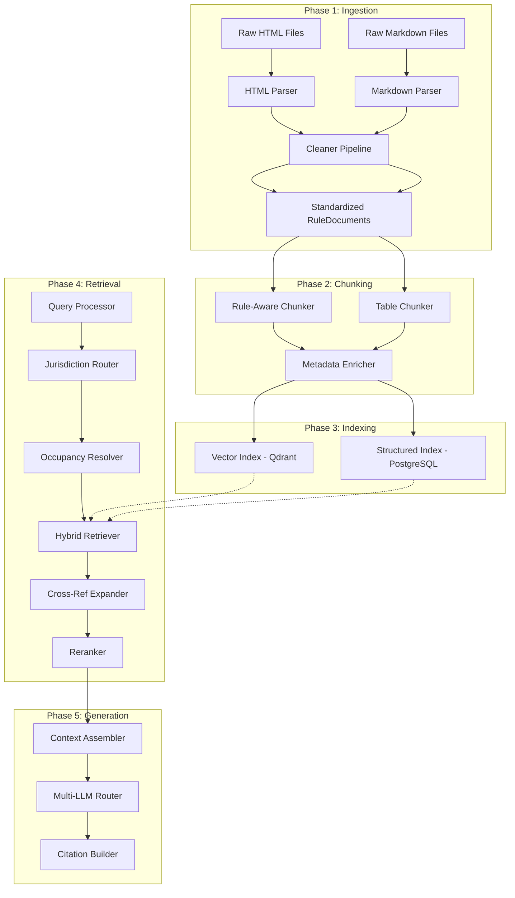
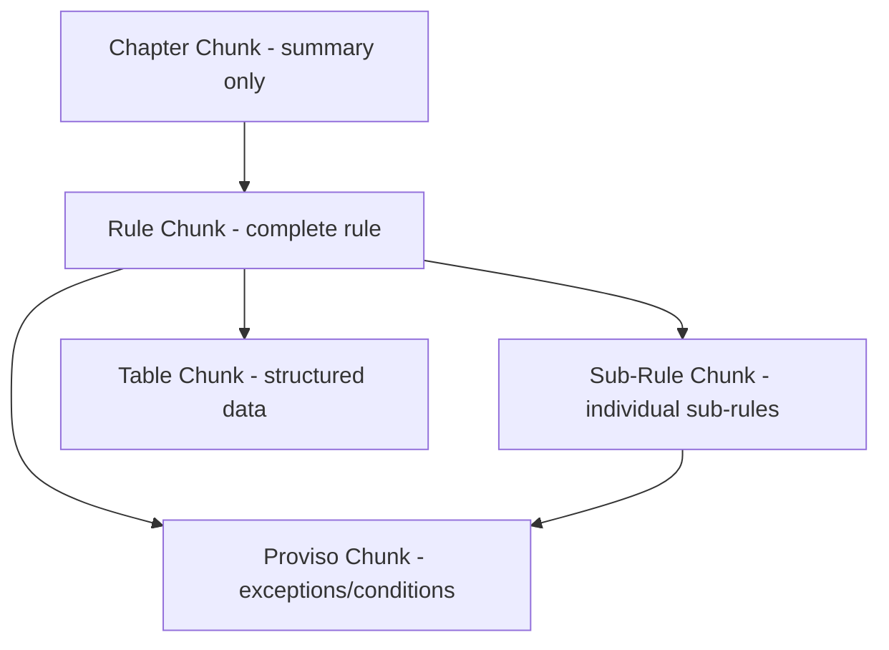

# PlotMagic: Jurisdiction-Aware Legal Compliance RAG

## Data Analysis Summary

After thorough analysis of both Kerala datasets:

**KMBR (Municipality, HTML, 6/34 chapters)**: Legacy FrontPage HTML. Rules 1-51 across chapters. Occupancy groups A1-I defined in Chapter 5. Tables for FAR/coverage/parking/height embedded as HTML tables. Amendment annotations in `<a title="...">` tooltips. Anchor tags like `chapter5-2` for navigation. JavaScript artifacts to strip.

**KPBR (Panchayat, Markdown, 7437 lines)**: PDF-converted markdown with code-block artifacts. Same occupancy groups but different thresholds. Additional Category I / Category II Panchayat distinction (different rules for each!). Tables in poorly-formatted markdown code blocks. Page number artifacts (`Page 65`) throughout.

**Critical structural observations**:

- Both rulesets share the same occupancy classification scheme (A1, A2, B, C, D, E, F, G1, G2, H, I) but with different thresholds and requirements
- Rules are deeply cross-referential ("as per Table 2", "under rule 27", "as in Appendix H")
- Some rules are generic (apply to all occupancies), some are occupancy-specific, some are conditional (height > 10m, area > 500 sqm)
- Tables carry critical numerical data (FAR ratios, setbacks, parking ratios) that must be preserved with full structure
- Provisos ("Provided that...") create exceptions and conditions that fundamentally modify the parent rule

---

## Architecture Overview




---

## Phase 1: Ingestion and Cleaning

### 1.1 Standardized Document Model

Every parser must produce this intermediate representation:

```python
@dataclass
class RuleDocument:
    state: str                          # "kerala"
    jurisdiction_type: str              # "municipality" | "panchayat"
    ruleset_id: str                     # "KMBR_1999" | "KPBR_2011"
    ruleset_version: str                # "1999" or "2011"
    effective_from: str | None          # Rule version start date (for temporal validity)
    effective_to: str | None            # Rule version end date (null = current)
    issuing_authority: str              # "LOCAL SELF GOVERNMENT (RD) DEPARTMENT"
    chapter_number: int
    chapter_title: str
    rule_number: str                    # "31" or "31A" (some rules have letters)
    rule_title: str                     # "Coverage and floor area ratio"
    sub_rule_path: str                  # "(2)(a)(iii)" - hierarchical address
    full_text: str
    occupancy_groups: list[str]         # ["A1", "F"] or [] for generic
    is_generic: bool                    # True if applies to all occupancies
    severity: str                       # "mandatory" | "conditional" | "advisory"
    tables: list[TableData]
    cross_references: list[CrossRef]    # Parsed references to other rules/tables
    amendments: list[Amendment]         # Tracked amendment history (action, amendment_ref, effective_from, effective_to)
    provisos: list[str]                 # "Provided that..." clauses
    conditions: dict                    # {"min_height": 10, "min_area": 500}
    source_anchor: str                  # "chapter5-2" for click-through
    source_file: str                    # Original file path
```

### 1.2 HTML Parser (for KMBR)

Target: `data/kerala/kmbr_muncipal_rules/chapter*.html`

- Use BeautifulSoup with `lxml` backend
- **Strip**: all `<script>` tags, `MM_reloadPage`/`MM_showHideLayers` JS, `<meta>` tags, FrontPage artifacts
- **Extract rules**: Pattern match on `<a name="chapterX-Y">Rule N. Title.-</a>` anchors
- **Extract tables**: Parse `<table>` elements, preserving row/column structure into `TableData(headers, rows, caption)` objects. Special handling for the hidden div-wrapped tables (like Table 2 in Chapter 5 which uses `visibility: hidden` + JS toggle)
- **Extract amendments**: Parse `<a title="Substituted by SRO No.170/2001...">` tooltip text
- **Extract cross-refs**: Regex for patterns like `Table \d+`, `Rule \d+`, `Appendix [A-Z]+`, `sub.rule \(\d+\)`
- **Extract provisos**: Split on "Provided that" / "Provided further that" / "Provided also that"
- **Severity detection**: Parse modal verbs -- "shall" = mandatory, "may" = conditional/advisory

### 1.2a Normalization Pipeline (applies to all parsers)

Runs after raw extraction, before producing `RuleDocument` objects:

- **Unit normalization**: Normalize `sq.m`, `sq metres`, `sq.metres`, `m2`, `square metres` -> `sq.m`. Normalize `%`, `percent`, `per cent` -> `%`. Store both raw and normalized values.
- **Label normalization dictionary**: Correct OCR drift from PDF conversion. Known corrections: `AI -> A1`, `GI -> G1`, `1(1) -> I(1)`, `Resdidential -> Residential`. Keep both raw and corrected values for audit.
- **Effective date extraction**: Parse amendment references to determine which version of a rule is current. `"Substituted by SRO No.170/2001"` -> `effective_date: 2001`.

### 1.3 Markdown Parser (for KPBR)

Target: `data/kerala/kpbr_panchayat_rule.md`

- **Strip**: Page number artifacts (lines matching `^\d+$` inside code blocks), stray code block wrappers that are PDF conversion artifacts (not actual code)
- **Extract rules**: Pattern match on `_\d+\.\s+.*\.-_` (italic rule headers) and `## \d+\.` headings
- **Split chapters**: Match `### CHAPTER` headings
- **Extract tables**: Parse markdown tables AND the pseudo-tables inside code blocks (like the FAR table, parking tables). Many KPBR tables are in code blocks with whitespace alignment -- need column-position-based parsing
- **Handle sub-rules**: Parse `(1)`, `(2)(a)`, `(i)`, `(ii)` numbering hierarchy
- **Extract Category I/II distinctions**: Some rules have different values for Category I vs II panchayats

### 1.4 State Configuration

```yaml
# config/states.yaml
states:
  kerala:
    jurisdictions:
      municipality:
        ruleset_id: KMBR_1999
        display_name: "Kerala Municipality Building Rules, 1999"
        source_format: html
        parser_class: KMBRHTMLParser
        source_path: "data/kerala/kmbr_muncipal_rules/"
        total_chapters: 34
        governing_act: "Kerala Municipality Act, 1994"
      panchayat:
        ruleset_id: KPBR_2011
        display_name: "Kerala Panchayat Buildings Rules, 2011"
        source_format: markdown
        parser_class: KPBRMarkdownParser
        source_path: "data/kerala/kpbr_panchayat_rule.md"
        governing_act: "Kerala Panchayat Raj Act, 1994"
        sub_categories: ["Category-I", "Category-II"]
    occupancy_groups:  # Shared across jurisdictions in Kerala
      A1: { name: "Residential", keywords: ["dwelling", "apartment", "flat", "house"] }
      A2: { name: "Lodging Houses", keywords: ["hotel", "hostel", "tourist home", "dormitory"] }
      B:  { name: "Educational", keywords: ["school", "college", "institute"] }
      C:  { name: "Medical/Hospital", keywords: ["hospital", "clinic", "dispensary"] }
      D:  { name: "Assembly", keywords: ["theatre", "auditorium", "wedding hall", "church", "temple"] }
      E:  { name: "Office/Business", keywords: ["office", "bank", "IT park"] }
      F:  { name: "Mercantile/Commercial", keywords: ["shop", "market", "mall", "showroom"] }
      G1: { name: "Industrial", keywords: ["factory", "manufacturing", "industry"] }
      G2: { name: "Small Industrial", keywords: ["workshop", "carpentry", "smithy", "coir"] }
      H:  { name: "Storage", keywords: ["warehouse", "godown", "storage"] }
      I:  { name: "Hazardous", keywords: ["explosive", "chemical", "inflammable"] }
```

Adding a new state = new YAML block + a parser (or reuse existing if format matches).

---

## Phase 2: Chunking Strategy

This is the most critical design decision. We do NOT use naive text splitting. We use **hierarchical, rule-aware, semantic chunking**.

### 2.1 Chunking Hierarchy




**Level 0 - Chapter summary**: A synthetic chunk containing chapter title + list of rules in it. Used for broad "what does Chapter 5 cover?" queries.

**Level 1 - Complete Rule**: The entire rule as one chunk. For rules under ~800 tokens, this IS the atomic unit. Contains rule title, all sub-rules, provisos, tables. Most rules fall here.

**Level 2 - Sub-Rule**: For complex rules (like Rule 31 with 15+ sub-rules), each sub-rule becomes a chunk. Each sub-rule chunk is prefixed with the parent rule title + applicability statement for context.

**Level 3 - Table**: Each table is a separate chunk, stored BOTH as:

- Structured JSON (for deterministic lookups)
- Natural language description (for vector search: "Table 2 shows the maximum permissible coverage is 60% for residential buildings with FAR of 1.50")

**Level 4 - Proviso/Exception**: "Provided that..." clauses that create meaningful exceptions. Linked to their parent rule. Critical for accurate compliance answers.

### 2.2 Chunking Rules

- **Max chunk size**: ~1000 tokens (but never break mid-rule or mid-sub-rule)
- **Context prefix**: Every sub-rule/table/proviso chunk gets prefixed with:
`[{ruleset_id}] Chapter {N}: {title} > Rule {M}: {rule_title}`
- **Overlap**: No sliding-window overlap. Instead, each chunk carries its hierarchical context. Parent rule's applicability clause is prepended to child chunks.
- **Table preservation**: Tables are NEVER split. If a table exceeds chunk size, it becomes its own chunk regardless of size. Tables are also stored separately in PostgreSQL for exact lookups.

### 2.3 Metadata Enrichment

Every chunk gets enriched metadata computed at ingestion time:

- `applies_to_occupancies`: Extracted from content analysis. Regex + heuristic: if the rule text mentions "Group F" or "mercantile", tag it. If it says "every building" or "all buildings", mark as generic.
- `topic_tags`: Classified into a controlled vocabulary: `[setback, parking, FAR, coverage, height, fire_safety, sanitation, access, staircase, ventilation, structural, permit, definition, exemption, penalty]`
- `rule_type`: `[definition, requirement, prohibition, exemption, procedure, penalty, specification]`
- `numeric_values`: Extracted key numbers: `{"min_setback_front": 3.0, "max_coverage_pct": 60, "max_FAR": 1.5}`
- `conditions`: When the rule applies: `{"min_height_m": 10, "min_floor_area_sqm": 500}`

---

## Phase 3: Indexing (Dual-Index Architecture)

### 3.1 Vector Index -- Qdrant

**Why Qdrant**: Native payload filtering is essential here. We must filter by `state + jurisdiction_type + occupancy_group` BEFORE vector similarity search. Qdrant's filtering happens at the index level (not post-retrieval), making it fast and accurate.

```
Collection: "building_rules"
Vector: 1536-dim (text-embedding-3-small) or 1024-dim (Cohere embed-v3)
Payload fields (filterable):
  - state: keyword
  - jurisdiction_type: keyword
  - ruleset_id: keyword
  - chapter_number: integer
  - rule_number: keyword
  - occupancy_groups: keyword[] (multi-value)
  - is_generic: bool
  - topic_tags: keyword[]
  - rule_type: keyword
  - chunk_level: keyword (chapter|rule|sub_rule|table|proviso)
```

Every search query gets pre-filtered: `state=kerala AND jurisdiction_type=municipality AND (occupancy_groups CONTAINS "F" OR is_generic=true)`.

### 3.2 Structured Index -- PostgreSQL

Relational tables for deterministic lookups and exact queries:

- `rulesets`: state, jurisdiction, name, version
- `chapters`: ruleset_id, number, title
- `rules`: chapter_id, number, title, full_text, is_generic, source_anchor
- `rule_occupancy_map`: rule_id, occupancy_group (many-to-many)
- `tables_data`: rule_id, table_number, headers_json, rows_json, caption
- `cross_references`: source_rule_id, target_type, target_id
- `occupancy_definitions`: ruleset_id, group_code, name, description, keywords

This enables queries like:

- "Give me all rules that apply to Group A1 in KMBR" (exact SQL query, no vector search needed)
- "What is the FAR for residential buildings?" (direct table lookup)
- "Which rules reference Rule 27?" (cross-reference query)

### 3.3 BM25 Index

A keyword index (using PostgreSQL full-text search or a dedicated BM25 engine like tantivy via `rank_bm25`) for:

- Exact legal term matching ("floor area ratio", "mezzanine floor")
- Rule number searches ("Rule 31")
- Specific legal phrase search ("provided that the height exceeds")

---

## Phase 4: Query Processing and Retrieval

### 4.1 Query Pipeline


### 4.2 Step-by-Step

**Step 1 - Intent Classification + Query Rephrasing** (LLM-based, lightweight):
Optionally rephrase the query into legal terminology for better retrieval (adopted from kb-codebase query rephrasing pattern, but applied selectively by query type -- see Patterns section).
Classify the query into:

- `informational`: "What is the maximum FAR for residential buildings?"
- `compliance_check`: "Can I build a 4-story commercial building on a 500 sqm plot in Thrissur?"
- `comparison`: "How do setback requirements differ between municipality and panchayat?"
- `calculation`: "How many parking spaces do I need for a 2000 sqm office building?"
Extract: location, building_type, specific_topics, mentioned_rule_numbers

**Step 2 - Jurisdiction Routing** (DETERMINISTIC):
Resolve `location -> local_body_type -> jurisdiction_type -> ruleset_id` using a maintained local-body registry (no LLM).  
If location cannot be mapped with certainty, return a clarification question (do not guess).  
For comparison queries, run two isolated retrieval paths (one per ruleset) and compare in the final answer.

**Step 3 - Occupancy Resolution** (DETERMINISTIC):

- First attempt: keyword match against `occupancy_groups.keywords` in config
- Apply deterministic threshold/intent rules (e.g., area and use qualifiers from definitions)
- If ambiguous: ask clarification (no LLM fallback)
- Output: one or more occupancy group codes
- Special case: if query doesn't specify building type, skip occupancy filtering (search generic rules + all)
- For KPBR panchayat queries, resolve `Category-I` / `Category-II` before retrieval (mandatory slot)

**Step 4 - Query Decomposition** (LLM-based, for complex queries):
Complex queries get decomposed into sub-queries:

- "What are the setback, parking, and FAR requirements for a hotel in a Category-I panchayat?"
becomes:
  - Sub-Q1: "setback requirements for Group A2 in KPBR"
  - Sub-Q2: "parking requirements for Group A2 in KPBR"
  - Sub-Q3: "FAR requirements for Group A2 in KPBR"
  - Sub-Q4: "Category-I specific provisions for Group A2 in KPBR"

**Step 5 - Hybrid Retrieval** (parallel, per sub-query -- adopts parallel multi-source pattern from kb-codebase):
Three retrieval paths run concurrently via `asyncio.gather`:

1. **Vector search** on Qdrant with metadata pre-filters (top-k=10 per sub-query)
2. **Structured query** on PostgreSQL for exact rule/table lookups
3. **BM25 keyword search** for specific terms

Results merged via **Reciprocal Rank Fusion (RRF)**.

**Step 6 - Generic Rule Augmentation** (CRITICAL):
After retrieving occupancy-specific rules, the system ALWAYS fetches:

- Generic rules with matching `topic_tags` (e.g., if setback rules were found for Group F, also fetch generic setback rules from Chapter IV that apply to ALL buildings)
- Definition rules (from Chapter I) for any defined terms used in retrieved rules
This is a deterministic step, not AI-based.

**Step 7 - Cross-Reference Expansion**:
For each retrieved chunk, check `cross_references`. If a rule says "as per Table 2" or "subject to Rule 27", fetch referenced chunks using bounded graph traversal with cycle detection (default depth = 2).

**Step 8 - Reranking** (adopts optional reranking pattern from kb-codebase, keeping both original and reranked scores):
Use a cross-encoder reranker (Cohere `rerank-v3.5` or a local cross-encoder) to score each chunk against the original query. Both `vector_score` and `rerank_score` are preserved in the evidence matrix. Dramatically improves precision by filtering out tangentially relevant results. Enabled by default but can be disabled for latency-sensitive browsing endpoints.

### 4.3 Conflict Resolution Policy (DETERMINISTIC)

When multiple rules apply to the same dimension (e.g., setback), resolve conflicts with these precedence rules:

1. **Amended text wins over original** -- if a rule has been substituted by a later SRO, use the amended version.
2. **Specific wins over generic** -- occupancy-specific rules override generic "all buildings" rules on the same topic.
3. **Most restrictive applies for mixed-use** -- per both KMBR and KPBR: "Any building which accommodates more than one use shall be included under the most restrictive group." Enforce this deterministically.
4. **Provisos narrow the parent** -- a proviso is an exception to its parent rule and takes precedence within its stated conditions.
5. **State/local Acts override rules** -- if a rule says "subject to provisions in the Act", flag that the Act provision may override.

### 4.4 Confidence and Clarification Loop

- Occupancy resolver returns deterministic match scores with trace reasons (keyword and rule hits).
- If top candidates are too close, return clarification INSTEAD of an answer: "Your description matches Group A2 and Group D. Which primary occupancy applies?"
- If critical slots (`location`/`jurisdiction_type`, `building_type`, `panchayat_category` where applicable) are missing, ask targeted follow-up before retrieval.

---

## Phase 5: Generation

### 5.1 Answer Structure

Every response follows a strict template:

```
JURISDICTION: [Kerala Municipality Building Rules, 1999]
OCCUPANCY GROUP: [Group F - Mercantile/Commercial]
APPLICABLE RULES:

1. [Topic: Setback Requirements]
   - Rule 24(3): Front yard minimum 3 metres for buildings up to 10m height
     [KMBR Rule 24(3)]
   - Rule 24(5): Side yard minimum 1.5 metres...
     [KMBR Rule 24(5)]
   - EXCEPTION: Rule 24(3) Proviso - In commercial zones, side yards 
     may not be required if... [KMBR Rule 24(3), Proviso]

2. [Topic: Coverage and FAR]
   | Occupancy | Coverage | FAR | FAR with additional fee |
   | Commercial | 50% | 1.50 | 2.0 / 2.5 |
   Source: [KMBR Rule 31, Table 2]

3. [Also Applicable - Generic Rules]
   - Rule 23: General requirements regarding plot... [KMBR Rule 23]

ASSUMPTIONS:
- Assumed Group F based on "commercial building" in query
- Assumed building height <= 10m (not specified)

UNRESOLVED:
- Plot area not provided; some coverage rules depend on plot size
- Fire NOC requirements depend on number of floors (not specified)

NOTES:
- Rules marked [GENERIC] apply to all building types
- Provisos and exceptions are highlighted where applicable
```

### 5.1a Hard Guardrails

- **Refuse unsupported claims**: If retrieved evidence does not contain information for a sub-question, the answer must state "Insufficient evidence in the available ruleset for [topic]. The following inputs are needed: [list]." Never hallucinate a rule.
- **Evidence matrix validation**: For complex queries (decomposed into sub-questions), build an evidence matrix. Each sub-question must have at least one retrieved chunk with reranker score > threshold. Only sub-results with evidence are included in the final answer. Gaps are listed explicitly.
- **No extrapolation across states**: If the user asks about a state whose data isn't ingested, refuse clearly rather than applying Kerala rules.

### 5.2 Citation Builder

Every factual statement in the answer is tagged with a citation object:

```python
@dataclass
class Citation:
    ruleset_id: str       # "KMBR_1999"
    rule_number: str      # "31"
    sub_rule: str          # "(2)"
    table_ref: str         # "Table 2" (if applicable)
    source_anchor: str     # "chapter5-2" (for click navigation)
    source_file: str       # "data/kerala/kmbr_muncipal_rules/chapter5.html"
    excerpt: str           # Exact quoted text from the rule
```

The API returns citations as structured objects so the frontend can render clickable links that navigate to the exact section.

### 5.3 Multi-LLM Support

Use **LiteLLM** as the abstraction layer:

```python
# Works with any provider
response = litellm.completion(
    model=settings.llm_model,  # "gpt-4o", "claude-sonnet-4-20250514", "gemini/gemini-pro"
    messages=[system_prompt, context, user_query],
    temperature=0.1,  # Low temperature for legal accuracy
)
```

Configurable via environment variable. No code changes to switch providers.

---

## Phase 6: State Extensibility

### Adding a new state requires:

1. **Drop data** into `data/{state_name}/`
2. **Write a parser** (or reuse existing HTML/Markdown parser if format matches)
3. **Add YAML config** block for the state
4. **Run ingestion** `python scripts/ingest.py --state {state_name}`
5. **Verify** with test queries

The entire pipeline from chunking onward is state-agnostic -- it operates on `RuleDocument` objects regardless of source.

---

## Project Structure

```
PlotMagic/
├── data/                              # Raw source data (per state)
│   └── kerala/
│       ├── kmbr_muncipal_rules/
│       └── kpbr_panchayat_rule.md
├── config/
│   ├── states.yaml                    # State/jurisdiction configuration
│   └── settings.py                    # App settings (DB URLs, LLM config)
├── src/
│   ├── models/                        # Shared data models
│   │   ├── documents.py               # RuleDocument, TableData, Citation
│   │   └── schemas.py                 # API request/response schemas
│   ├── ingestion/                     # Phase 1
│   │   ├── parsers/
│   │   │   ├── base.py                # Abstract RulesetParser
│   │   │   ├── html_parser.py         # KMBR HTML parser
│   │   │   └── markdown_parser.py     # KPBR Markdown parser
│   │   ├── cleaners.py                # HTML/MD cleaning utilities
│   │   ├── normalizers.py             # Unit normalization, label correction, OCR fixes
│   │   └── pipeline.py                # Orchestrates full ingestion
│   ├── chunking/                      # Phase 2
│   │   ├── rule_chunker.py            # Hierarchical rule-aware chunker
│   │   ├── table_chunker.py           # Table-specific chunking
│   │   └── enrichment.py              # Metadata enrichment (topic tags, occupancy detection)
│   ├── indexing/                       # Phase 3
│   │   ├── vector_store.py            # Qdrant operations
│   │   ├── structured_store.py        # PostgreSQL operations
│   │   └── embeddings.py              # Embedding generation
│   ├── retrieval/                      # Phase 4
│   │   ├── query_processor.py         # Intent classification + decomposition
│   │   ├── jurisdiction_router.py     # Location -> jurisdiction routing
│   │   ├── occupancy_resolver.py      # Intent -> occupancy group mapping
│   │   ├── hybrid_retriever.py        # Vector + structured + BM25
│   │   ├── generic_augmenter.py       # Always-fetch generic rules
│   │   ├── cross_ref_resolver.py      # Cross-reference expansion
│   │   └── reranker.py                # Result reranking
│   ├── generation/                     # Phase 5
│   │   ├── answer_generator.py        # LLM-based answer synthesis
│   │   ├── citation_builder.py        # Traceable citation generation
│   │   ├── prompts.py                 # Prompt templates
│   │   └── llm_provider.py            # LiteLLM multi-provider abstraction
│   └── api/                            # API layer
│       ├── main.py                     # FastAPI app
│       ├── routes/
│       │   ├── applicability.py        # /resolve-applicability endpoint (deterministic scope)
│       │   ├── query.py                # /query endpoint (full QnA)
│       │   ├── explain.py              # /explain endpoint (deep-dive single rule)
│       │   ├── rules.py                # /rules browse endpoints
│       │   └── ingest.py               # /ingest trigger endpoints
│       └── middleware.py
├── scripts/
│   ├── ingest.py                       # CLI: run full ingestion pipeline
│   └── evaluate.py                     # RAG evaluation harness
├── tests/
├── docker-compose.yaml                 # Qdrant + PostgreSQL
├── requirements.txt
└── README.md
```

---

## Tech Stack Summary


| Component     | Choice                          | Rationale                                                                    |
| ------------- | ------------------------------- | ---------------------------------------------------------------------------- |
| Language      | Python 3.11+                    | Best ML/NLP ecosystem, all LLM SDKs are Python-first                         |
| Framework     | FastAPI                         | Async, fast, auto-docs, great for API-first design                           |
| Vector DB     | Qdrant                          | Native payload filtering (critical for jurisdiction/occupancy pre-filtering) |
| Relational DB | PostgreSQL                      | Structured rule storage, full-text search (BM25), battle-tested              |
| Embeddings    | text-embedding-3-small (OpenAI) | Good quality/cost ratio, 1536 dims                                           |
| Reranker      | Cohere rerank-v3.5              | Cross-encoder reranking for precision                                        |
| LLM           | LiteLLM (multi-provider)        | Switch between GPT-4o, Claude, Gemini via config                             |
| HTML Parsing  | BeautifulSoup + lxml            | Best-in-class HTML parsing for legacy markup                                 |
| Orchestration | Custom pipeline (no LangChain)  | Deterministic control flow, no framework overhead for a rule-engine          |


**Why no LangChain/LlamaIndex**: This system is a *deterministic rule-selection engine*, not a generic chatbot. The retrieval logic (jurisdiction routing -> occupancy resolution -> generic augmentation -> cross-ref expansion) requires precise control flow that framework abstractions would complicate rather than simplify. We use LiteLLM only for the LLM abstraction layer.

---

## Patterns Adopted from kb-codebase (TypeScript RAG)

The existing `kb-codebase/` is a generic multi-source RAG system (TypeScript, MongoDB Atlas Vector Search, Gemini embeddings). It is not directly reusable for PlotMagic (wrong chunking strategy, thin metadata model, no deterministic routing, language mismatch -- see analysis). However, the following **proven patterns** are adopted and adapted into our Python pipeline:

### Pattern 1: Stage-by-Stage Latency Tracking

From `kb-codebase/knowledgeBase.service.ts` -- the `getChunks` method tracks timing at every pipeline stage (rephrasing, embedding, retrieval, reranking, metadata attachment) and returns it in the response.

**Adopted in**: `src/retrieval/hybrid_retriever.py` and `src/api/routes/query.py`. Every PlotMagic query response includes a `latency` object:

```python
@dataclass
class QueryLatency:
    intent_classification_ms: float
    jurisdiction_routing_ms: float
    occupancy_resolution_ms: float
    query_decomposition_ms: float
    embedding_generation_ms: float
    vector_search_ms: float
    structured_search_ms: float
    bm25_search_ms: float
    generic_augmentation_ms: float
    cross_ref_expansion_ms: float
    reranking_ms: float
    llm_generation_ms: float
    total_ms: float
```

### Pattern 2: Score Threshold Filtering with Source-Aware Thresholds

From `kb-codebase/common/constants.ts` -- old sources use threshold 0.7, new sources use 0.5. Different source types have different reliability profiles.

**Adopted in**: `src/retrieval/hybrid_retriever.py`. PlotMagic uses differentiated thresholds by chunk type:

- `rule` and `sub_rule` chunks: threshold 0.6 (core legal content, higher reliability)
- `table` chunks: threshold 0.5 (tables often have lower semantic similarity but are highly relevant)
- `proviso` chunks: threshold 0.5 (exceptions are often phrased differently from queries)
- `chapter_summary` chunks: threshold 0.7 (only include if highly relevant)

### Pattern 3: Async Fire-and-Forget Evaluation Tracking

From `kb-codebase/knowledgeBase.service.ts` -- `triggerEvalAsync` sends evaluation data to PubSub without blocking the response. The eval worker classifies queries as `KB_GAP` vs `NON_KB_GAP`.

**Adopted in**: `src/api/middleware.py` and `scripts/evaluate.py`. Every PlotMagic query logs asynchronously (via background task, not blocking the response):

- Query text, resolved jurisdiction, resolved occupancy group
- Retrieved chunk IDs and scores (before and after reranking)
- Evidence matrix (which sub-questions had evidence, which had gaps)
- Whether clarification was needed
- User feedback (if provided later)

This feeds the evaluation harness and helps identify coverage gaps per state/jurisdiction/occupancy.

### Pattern 4: Optional Query Rephrasing Before Embedding

From `kb-codebase/helpers/chunks.ts` -- `queryRephraser` uses Gemini to rephrase the user query for better retrieval, controlled by a `rephraseQuery` flag.

**Adopted in**: `src/retrieval/query_processor.py`. PlotMagic uses this selectively:

- For `informational` queries: rephrase into legal terminology ("parking space" -> "off-street parking space as per Rule 38")
- For `compliance_check` queries: extract structured slots instead of rephrasing
- For `comparison` queries: decompose rather than rephrase
- Controlled by query type, not a blanket flag.

### Pattern 5: Parallel Multi-Source Retrieval

From `kb-codebase/knowledgeBase.service.ts` -- `retrieveAllChunks` fires retrievals to FAQ, Crawler, KB, Web Search, and Table SQL services in parallel using `Promise.all`.

**Adopted in**: `src/retrieval/hybrid_retriever.py`. PlotMagic runs three retrieval paths concurrently per sub-query using `asyncio.gather`:

1. Qdrant vector search (with metadata pre-filters)
2. PostgreSQL structured lookup (exact rule/table queries)
3. PostgreSQL full-text search (BM25 for legal terms)

Results merge via RRF. This is the same parallel-then-merge pattern, applied to our domain-specific indexes.

### Pattern 6: Reranking as an Optional Post-Retrieval Step

From `kb-codebase/helpers/chunks.ts` -- `rerankChunks` applies a reranker and attaches `scoreAfterReranking` alongside the original `score`, controlled by a `rerankChunks` flag.

**Adopted in**: `src/retrieval/reranker.py`. PlotMagic keeps both scores:

- `vector_score`: original retrieval score
- `rerank_score`: cross-encoder score from Cohere rerank-v3.5

Both are stored in the evidence matrix. Reranking is enabled by default but can be disabled for latency-sensitive paths (e.g., rule browsing).

### Pattern 7: Hybrid Search Weighting

From `kb-codebase/helpers/mongoSearchHelper.ts` -- hybrid search combines vector score (weight 0.7) with full-text score (weight 0.3).

**Adopted in**: `src/retrieval/hybrid_retriever.py`. PlotMagic uses RRF (Reciprocal Rank Fusion) instead of weighted sum because we have three signals (vector + structured + BM25), but the kb-codebase's 0.7/0.3 split validates that vector similarity should be the primary signal with keyword matching as a secondary boost. Our RRF parameters reflect this: vector results get rank position 1-based, BM25 results get a rank offset.

### Pattern 8: Chunk Deduplication Before Response

From `kb-codebase/knowledgeBase.service.ts` -- deduplicates chunks with identical content before returning, since multiple retrieval paths can surface the same chunk.

**Adopted in**: `src/retrieval/hybrid_retriever.py`. After RRF merging, PlotMagic deduplicates by `(ruleset_id, rule_number, sub_rule_path)` -- the legal address, not just content string matching. If the same rule appears from vector search AND BM25, the higher-scored instance is kept.

---

## Implementation Order

Build and validate each phase end-to-end before moving to the next. Start with KMBR (HTML) since it's the more structured source.