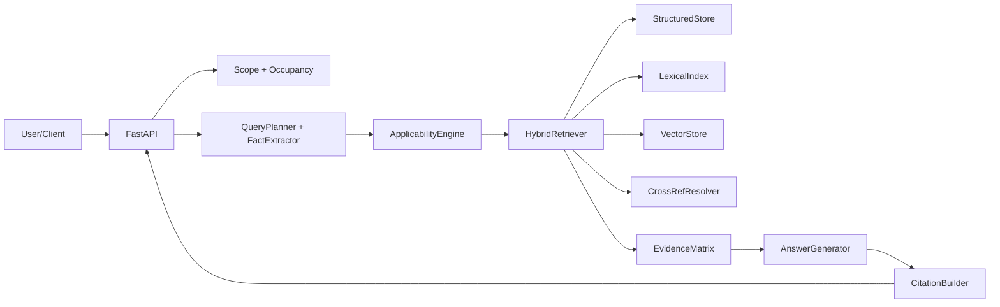
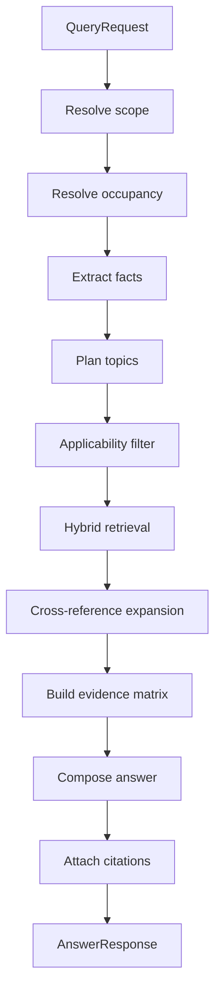

# PlotMagic: A Beginner's Guide

**Welcome!** This guide is written for interns and new contributors. By the end, you'll understand what PlotMagic does, how it's built, and where to start making changes.

---

## What's in this guide

1. **The big picture** – What PlotMagic does (in plain English)
2. **A question's journey** – What happens when someone asks "What's the max FAR for my house?"
3. **How the code is organized** – A map of the codebase
4. **Understanding the data** – The key models, explained simply
5. **Each piece in detail** – Ingestion, retrieval, generation
6. **Get up and running** – Setup, ingest, run, query
7. **Where to look when…** – Quick debugging guide
8. **How to extend** – Add local bodies, add states
9. **Tasks for interns** – Good first contributions
10. **Troubleshooting** – Common issues and fixes

---

## 1. The big picture (2 minutes)

### What problem does PlotMagic solve?

When someone builds a house or commercial building in India, they need to follow **building rules** that vary by:

- **State** (e.g. Kerala)
- **Jurisdiction** (municipality vs panchayat – different rulebooks)
- **Location** (Thrissur vs a small village)
- **Building type** (residential, commercial, hostel, etc.)

The rules are long, dense, and scattered. PlotMagic helps by:

1. **Figuring out which rulebook applies** – Is this a municipality (KMBR) or panchayat (KPBR) question?
2. **Finding the right rules** – Not everything applies; we filter by location, building type, and topic
3. **Returning an answer with sources** – Every claim links back to the exact rule, so users can verify

**In one sentence:** PlotMagic is a compliance assistant that answers building-rule questions with traceable legal citations.

### What PlotMagic is *not*

- It's **not** a generic chatbot. It doesn't guess. It selects rules deterministically and explains them.
- It's **not** a database of rules. It *parses* legal documents (HTML, Markdown), indexes them, and retrieves the right pieces.

---

## 2. A question's journey

Let's trace what happens when a user asks:

> *"What is the maximum FAR for a residential building in Thrissur?"*

This walkthrough matches the code flow in `src/api/service.py`.

### Step 1: Figure out the rulebook (Scope resolution)

**Question we answer:** *Which rulebook applies – KMBR (municipality) or KPBR (panchayat)?*

- The user said "Thrissur". Is Thrissur a municipality or a panchayat? → We look it up in `config/local_bodies/kerala_local_bodies.yaml`.
- Result: Thrissur is a municipality → KMBR applies.

**Code:** `ScopeResolver` in `src/retrieval/scope_resolver.py`

---

### Step 2: Figure out the building type (Occupancy resolution)

**Question we answer:** *What kind of building is this – residential, commercial, mixed-use, etc.?*

- The user said "residential building". We match that to a standard occupancy code (e.g. Group A for residential).
- If the user just said "building" without saying what kind, we might ask for clarification.

**Code:** `OccupancyResolver` in `src/retrieval/occupancy_resolver.py`

---

### Step 3: Understand the question (Fact extraction + query planning)

**Question we answer:** *What are they really asking about?*

- "maximum FAR" → topic is FAR (Floor Area Ratio)
- We may extract numbers (plot size, storeys) if mentioned.
- We plan which rule topics to search for.

**Code:** `FactExtractor` + `QueryPlanner` in `src/retrieval/`

---

### Step 4: Filter to relevant rules (Applicability engine)

**Question we answer:** *Which rules in our corpus actually apply to this case?*

- We don't search every rule. We first filter by:
  - State, jurisdiction, location
  - Occupancy (residential vs commercial, etc.)
  - Topic (FAR, parking, setback, etc.)
- The result is a **candidate set** – rules that *might* be relevant.

**Code:** `ApplicabilityEngine` in `src/retrieval/applicability_engine.py`

---

### Step 5: Search within the candidates (Hybrid retrieval)

**Question we answer:** *Which specific clauses best answer the question?*

- We search the candidate set using three methods:
  - **Vector search** – semantic similarity ("FAR" matches "floor area ratio")
  - **Lexical search** – keyword/BM25 ("Rule 31", "Table 2")
  - **Structured search** – exact lookups in tables
- We merge results and build an **evidence matrix** – which clause supports which part of the answer.

**Code:** `HybridRetriever` in `src/retrieval/hybrid_retriever.py`

---

### Step 6: Write the answer with citations (Generation)

**Question we answer:** *How do we present this to the user?*

- We compose a structured answer (sections, bullet points).
- Every claim gets a **citation** – rule number, anchor, excerpt, source file – so the user can verify.

**Code:** `AnswerGenerator` + `CitationBuilder` in `src/generation/`

---

### The flow in one diagram

```
User question
    ↓
Scope (which rulebook?) → Occupancy (what building type?) → Facts (what’s the question about?)
    ↓
Applicability (which rules apply?)
    ↓
Hybrid retrieval (which clauses answer it?)
    ↓
Evidence matrix → Answer + citations
```

---

## 3. How the code is organized

Here's a map of the main folders and what they do.

| Folder / file | What it does |
|---------------|--------------|
| `src/models/` | Defines the data structures – rules, clauses, tables. Start here to understand "what a rule looks like" in code. |
| `src/ingestion/` | Reads HTML/Markdown legal docs, parses them into `RuleDocument` and `ClauseNode` objects, runs QC. |
| `src/indexing/` | Builds search indexes (structured DB, lexical/BM25, vector) so we can quickly find clauses. |
| `src/retrieval/` | The "brain" – scope, occupancy, applicability, hybrid search, evidence. |
| `src/generation/` | Turns retrieved evidence into a human-readable answer with citations. |
| `src/api/` | FastAPI routes and the `ComplianceEngine` that wires everything together. |
| `config/` | YAML configs – states, local bodies, occupancy mappings. |
| `data/` | Raw legal source files (HTML, MD) and statepacks. |
| `scripts/` | CLI tools – ingest, query, evaluate. |

### Where to read first

1. **`src/models/documents.py`** – See `RuleDocument` and `ClauseNode`; these are the core data.
2. **`src/api/service.py`** – See `ComplianceEngine.query()`; this is the full query flow.
3. **`src/retrieval/scope_resolver.py`** – Simple example of deterministic logic.

---

## 4. Understanding the data

### Why two levels: RuleDocument vs ClauseNode?

Think of it like a book:

- **RuleDocument** = one chapter (e.g. "Chapter 5 – Setbacks")
- **ClauseNode** = one paragraph or bullet (a rule, sub-rule, proviso, note, or table)

We need both because:

- **Rule-level** is good for: "Does this rule apply to my case?" (broad filtering)
- **Clause-level** is good for: "What’s the exact sentence I need?" (precise citations)

### Key data structures (simplified)

| Model | What it represents |
|-------|--------------------|
| `RuleDocument` | One rule or chapter – state, jurisdiction, rule number, list of clauses. |
| `ClauseNode` | One legal unit – a rule, sub-rule, proviso, note, or table. Has `anchor_id`, `source_file`, `raw_text`, and metadata. |
| `TableData` | A legal table – headers, rows – for structured lookups. |
| `QueryFact` | What we know about the user's question – state, location, occupancy, topics. |
| `Citation` | A reference to a source – rule number, anchor, excerpt – attached to a claim. |

### The object flow (for debugging)

When you change code, know which layer you're in:

| You're touching… | So you're in… | Example |
|------------------|---------------|---------|
| Parsing, HTML/MD handling | Ingestion | `RuleDocument` / `ClauseNode` creation |
| "Which rulebook / location?" | Scope | `ScopeResolver` |
| "What building type?" | Occupancy | `OccupancyResolver` |
| "Which rules apply?" | Applicability | `ApplicabilityEngine` |
| "Which clauses match?" | Retrieval | `HybridRetriever`, indexes |
| "How do we phrase the answer?" | Generation | `AnswerGenerator`, `CitationBuilder` |
| Request/response shape | API | `schemas.py`, routes |

---

## 5. Each piece in detail

### A. Ingestion (`src/ingestion/`)

**What it does:** Turns raw legal files (KMBR HTML, KPBR Markdown) into structured `RuleDocument` and `ClauseNode` objects.

**Flow:** Clean → Parse → Build canonical models → QC → Index

**Key files:**
- `pipeline.py` – Orchestrates the pipeline
- `parsers/kmbr_html_parser.py` – KMBR (municipality)
- `parsers/kpbr_markdown_parser.py` – KPBR (panchayat)

---

### B. Scope & occupancy (`src/retrieval/`)

**ScopeResolver** – Maps location (e.g. "Thrissur") to jurisdiction (municipality/panchayat) and rulebook (KMBR/KPBR). Uses `config/local_bodies/kerala_local_bodies.yaml`.

**OccupancyResolver** – Maps building descriptions to occupancy groups (A1, F, etc.). Uses keyword matching and config.

---

### C. Applicability engine (`src/retrieval/applicability_engine.py`)

Filters the corpus to rules that *could* apply. Checks:
- State, jurisdiction, effective dates
- Panchayat category (I vs II) where relevant
- Occupancy (generic vs occupancy-specific)
- Topic tags

---

### D. Indexing triad (`src/indexing/`)

| Index | Purpose |
|-------|---------|
| Structured store (SQLite) | Exact rule/clause lookups, table cells |
| Lexical index (BM25) | Keyword and rule-number search |
| Vector store | Semantic similarity (in-memory for dev; Qdrant for prod) |

---

### E. Hybrid retrieval (`src/retrieval/hybrid_retriever.py`)

Merges results from all three indexes, resolves cross-references, and builds an evidence matrix before generation.

---

### F. Generation (`src/generation/`)

- **AnswerGenerator** – Composes sections from the evidence matrix
- **CitationBuilder** – Attaches citations with anchors and excerpts

---

## 6. Get up and running

### Prerequisites

- Python 3.11+
- macOS or Linux

### Setup

```bash
python3 -m venv .venv
.venv/bin/pip install -r requirements.txt
.venv/bin/pip install pytest
```

### Ingest data

```bash
.venv/bin/python scripts/ingest.py --state kerala --jurisdiction municipality
.venv/bin/python scripts/ingest.py --state kerala --jurisdiction panchayat
```

### Run the API

```bash
.venv/bin/python scripts/run_local.py --warm-ingest --port 8000
```

### API endpoints (quick reference)

| Endpoint | Purpose |
|----------|---------|
| `POST /ingest` | Trigger ingestion (state, jurisdiction) |
| `POST /resolve-applicability` | See which rules apply for a building |
| `POST /query` | Ask a compliance question |
| `GET /rules/browse` | Browse indexed rules |
| `GET /explain?rule_number=31` | Get explanation for a specific rule |

**Example – ask a question:**
```bash
curl -X POST http://127.0.0.1:8000/query \
  -H "Content-Type: application/json" \
  -d '{"state":"kerala","location":"Anthikkad","query":"Parking requirements for a hostel?"}'
```

### Try a query

**CLI (direct):**
```bash
.venv/bin/python scripts/query_cli.py --direct \
  --state kerala \
  --jurisdiction municipality \
  --location Thrissur \
  --query "What is the maximum FAR for residential buildings?"
```

**API:**
```bash
curl -X POST http://127.0.0.1:8000/query \
  -H "Content-Type: application/json" \
  -d '{
    "state":"kerala",
    "location":"Anthikkad",
    "query":"What are the parking requirements for a hostel in Anthikkad panchayat?"
  }'
```

### Run tests and evaluation

```bash
.venv/bin/python -m pytest -q
.venv/bin/python scripts/evaluate.py --state kerala
```

---

## 7. Where to look when…

| Problem | Look here |
|---------|-----------|
| A rule is missing or wrong in answers | Parsers, ingestion pipeline, canonical models |
| Wrong rulebook chosen (KMBR vs KPBR) | `ScopeResolver`, `config/local_bodies/` |
| Wrong building type inferred | `OccupancyResolver`, occupancy config |
| Irrelevant rules in answers | `ApplicabilityEngine`, topic/occupancy filters |
| Good rules not found | Hybrid retrieval, indexes, `top_k` |
| Citation is wrong or broken | `CitationBuilder`, anchor mapping |
| API returns wrong shape | `schemas.py`, route handlers |

---

## 8. How to extend

### Add a new Kerala local body

Edit `config/local_bodies/kerala_local_bodies.yaml`. Add:
- `canonical_name`
- `aliases` (so "Thrissur" and "Trichur" both work)
- `jurisdiction_type` (municipality/panchayat)
- `panchayat_category` if panchayat

Then re-run ingestion and tests.

### Add a new state

See `docs/state_extension_guide.md`. High-level steps:
1. Add state data under `data/{state}`
2. Add or reuse parsers
3. Update `config/states.yaml`
4. Add local body config under `config/local_bodies/`
5. Add statepack manifest
6. Add tests and gold queries

---

## 9. Tasks for interns

### Week 1 (good first tasks)

- Add 20+ local-body alias entries with tests
- Add 10 gold queries for jurisdiction/occupancy edge cases
- Improve parser unit tests for one noisy KPBR segment

### Week 2–3 (intermediate)

- Improve table cell extraction for KPBR Table 2/4/5
- Implement stricter mixed-use restrictive policy + tests
- Add endpoint-level latency tests

### Advanced

- Integrate PostgreSQL + Qdrant adapters
- Implement date-effective retrieval for amendments
- Add confidence audit reports per answer

---

## 10. Troubleshooting

**`ModuleNotFoundError`** – Use the project venv: `.venv/bin/python scripts/ingest.py ...`

**Ingestion returns 0 rules** – Check `config/states.yaml` source paths and that input files exist and are non-empty.

**Scope resolver asks too many clarifications** – Add aliases in `config/local_bodies/kerala_local_bodies.yaml` or include jurisdiction hint in the request.

**Evaluation drops** – Inspect per-query diagnostics in `scripts/evaluate.py`; compare `answer_sections`, `citations`, and `clarifications`.

---

## 11. Known limitations

- Local body registry is partial, not exhaustive
- KPBR table parsing has fallbacks for malformed blocks
- SQLite and in-memory vector store are for dev; production needs PostgreSQL + Qdrant
- Gold query set is still small

---

## 12. Improvement roadmap

**P0 (near-term):** Better local body data, robust KPBR table parsing, 200+ gold queries, amendment/proviso regression tests.

**P1:** PostgreSQL, Qdrant, optional reranker, richer mixed-use rules.

**P2:** UI, multi-state onboarding, temporal queries ("as of date"), style controls.

---

## Final note

PlotMagic is built around a deterministic core: we decide which rules apply *before* we search. That keeps answers auditable and legal-quality high.

**If you're an intern:** Start small, write tests first, and keep every change traceable to evidence quality. When in doubt, trace a query through `service.py` and see which component you're changing.

---

## Appendix: Architecture diagrams (for reference)

### Component flow



### Query flow (step-by-step)


